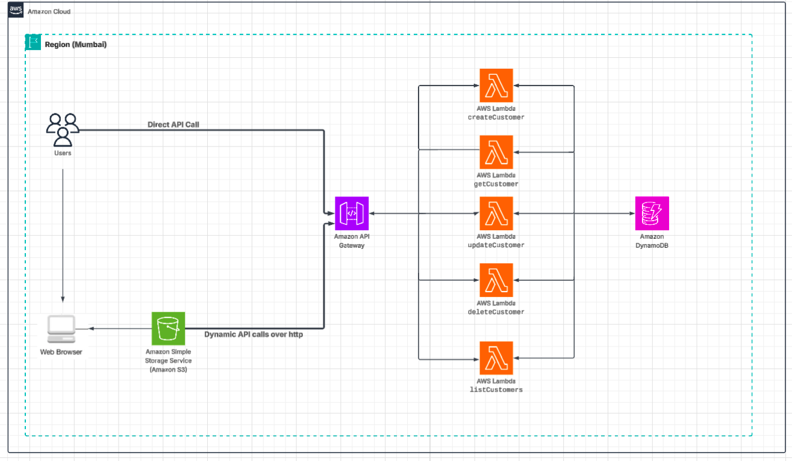
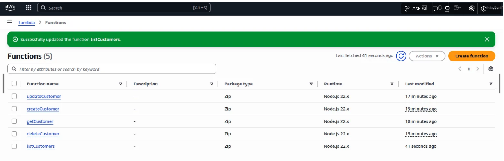
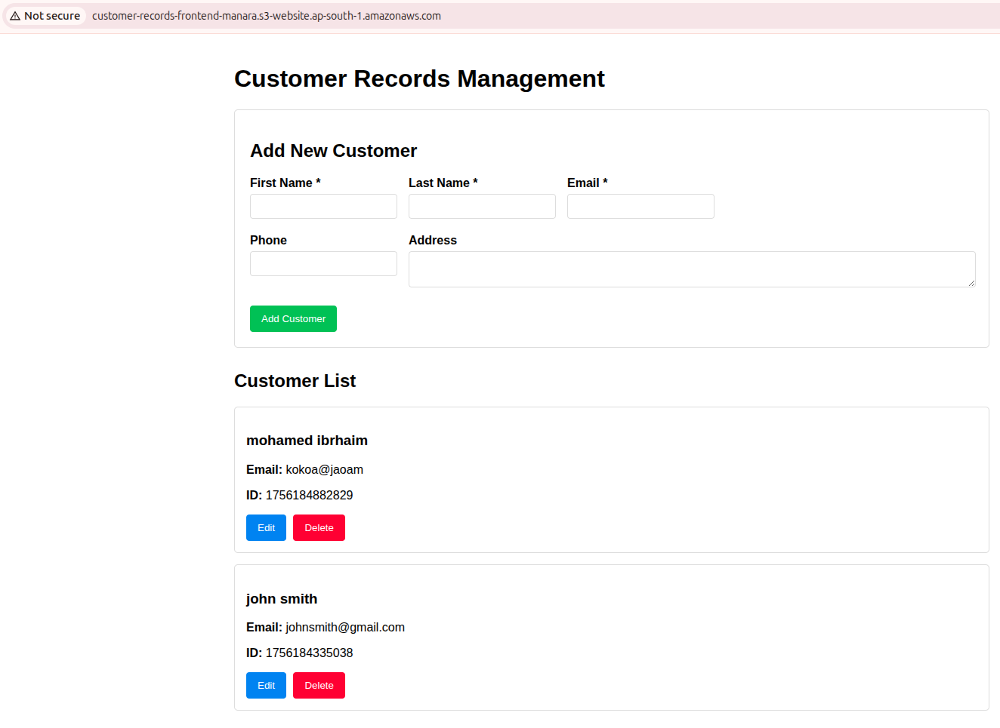

# Serverless Customer Records API with ES Module Syntax
Develop a serverless REST API using Amazon API Gateway, AWS Lambda, and DynamoDB to manage customer records. 
The API allows users to create, read, update, and delete (CRUD) data without managing servers.

## Contents
- [Architecture Overview](#architecture-overview)
- [Step 1: Set Up DynamoDB Table](#step-1-set-up-dynamodb-table)
- [Step 2: Create IAM Role for Lambda Functions](#step-2-create-iam-role-for-lambda-functions)
- [Step 3: Create Lambda Functions with ES Module Syntax](#step-3-create-lambda-functions-with-es-module-syntax)
   - [Create Customer Lambda](#1-create-customer-lambda-createcustomer)
   - [Get Customer Lambda](#2-get-customer-lambda-getcustomer)
   - [Update Customer Lambda](#3-update-customer-lambda-updatecustomer)
   - [Delete Customer Lambda](#4-delete-customer-lambda-deletecustomer)
   - [List All Customers Lambda](#5-list-all-customers-lambda-listcustomers)
- [Step 4: Set Up API Gateway](#step-4-set-up-api-gateway)
- [Step 5: Create S3 Bucket for Frontend](#step-5-create-s3-bucket-for-frontend)
- [Step 6: Create Frontend Files](#step-6-create-frontend-files)
   - [index.html](#indexhtml)
   - [app.js](#appjs)
- [Step 7: Testing API Using Curl & Through the S3 website endpoint](#step-7-testing-api-using-curl--through-the-s3-website-endpoint)
- [ Author](#author)
- [📜 License](#-license)

## Architecture Overview

1. **Frontend**: HTML/JS hosted on S3
2. **API Layer**: API Gateway
3. **Business Logic**: Lambda functions (using ES modules)
4. **Database**: DynamoDB

```jsx
Frontend (S3) → API Gateway → Lambda → DynamoDB
	
```



## Step 1: Set Up DynamoDB Table

**GUI Steps:**

1. Navigate to DynamoDB in AWS Console
2. Click "Create table"
3. Table name: `CustomerRecords`
4. Partition key: `customerId` (String)
5. Settings: Choose "On-demand" capacity mode
6. Click "Create table"

## Step 2: Create IAM Role for Lambda Functions

1. **Navigate to IAM Console:**
    - Go to AWS IAM console
    - Click "Roles" in the left sidebar
    - Click "Create role"
2. **Select Trusted Entity:**
    - Choose "AWS service" as trusted entity type
    - Select "Lambda" as use case
    - Click "Next"
3. **Add Permissions:**
    - Attach managed policy: **AWSLambdaBasicExecutionRole** (for logging)
    - Click "Next"
4. **Name and Create Role:**
    - Role name: `CustomerRecordsLambdaRole`
    - Description: "Role for Customer Records Lambda functions to access DynamoDB"
    - Click "Create role"
5. **Add Inline Policy:**
    - From the IAM **Roles** list, Choose  `CustomerRecordsLambdaRole`
    - On the **Permissions** tab , Click "Add permissions" → "Create inline policy"
    - Policy name : `CustomerRecordsDynamoDBAccess`
    - Go to JSON tab and paste:

```json
{
    "Version": "2012-10-17",
    "Statement": [
        {
            "Effect": "Allow",
            "Action": [
                "dynamodb:PutItem",
                "dynamodb:GetItem",
                "dynamodb:UpdateItem",
                "dynamodb:DeleteItem",
                "dynamodb:Scan"
            ],
            "Resource": [
                "arn:aws:dynamodb:ap-south-1:ACCOUNT-ID:table/CustomerRecords",
                "arn:aws:dynamodb:ap-south-1:ACCOUNT-ID:table/CustomerRecords/index/*"
            ]
        },
        {
            "Effect": "Allow",
            "Action": [
                "logs:CreateLogGroup",
                "logs:CreateLogStream",
                "logs:PutLogEvents"
            ],
            "Resource": "arn:aws:logs:*:*:*"
        }
    ]
}

```

- My region is `ap-south-1`
- Name the policy `CustomerRecordsDynamoDBAccess`
- Click "Create policy"

## Step 3: Create Lambda Functions with ES Module Syntax

All Lambda functions will use the `CustomerRecordsLambdaRole` and ES module syntax.

### 1. Create Customer Lambda (`createCustomer`)

```jsx
import { DynamoDBClient } from "@aws-sdk/client-dynamodb";
import { DynamoDBDocumentClient, PutCommand } from "@aws-sdk/lib-dynamodb";

const client = new DynamoDBClient({});
const docClient = DynamoDBDocumentClient.from(client);

export const handler = async (event) => {
    const { firstName, lastName, email, phone, address } = JSON.parse(event.body);
    const customerId = Date.now().toString();

    // Basic validation
    if (!firstName || !lastName || !email) {
        return {
            statusCode: 400,
            headers: {
                'Access-Control-Allow-Origin': '*',
                'Access-Control-Allow-Credentials': true
            },
            body: JSON.stringify({ error: 'First name, last name, and email are required' })
        };
    }

    const params = {
        TableName: 'CustomerRecords',
        Item: { customerId, firstName, lastName, email, phone, address }
    };

    try {
        await docClient.send(new PutCommand(params));
        return {
            statusCode: 201,
            headers: {
                'Access-Control-Allow-Origin': '*',
                'Access-Control-Allow-Credentials': true
            },
            body: JSON.stringify({ customerId, firstName, lastName, email, phone, address })
        };
    } catch (error) {
        return {
            statusCode: 500,
            headers: {
                'Access-Control-Allow-Origin': '*',
                'Access-Control-Allow-Credentials': true
            },
            body: JSON.stringify({ error: error.message })
        };
    }
};

```

### 2. Get Customer Lambda (`getCustomer`)

```jsx
import { DynamoDBClient } from "@aws-sdk/client-dynamodb";
import { DynamoDBDocumentClient, GetCommand } from "@aws-sdk/lib-dynamodb";

const client = new DynamoDBClient({});
const docClient = DynamoDBDocumentClient.from(client);

export const handler = async (event) => {
    const customerId = event.pathParameters.customerId;

    const params = {
        TableName: 'CustomerRecords',
        Key: { customerId }
    };

    try {
        const result = await docClient.send(new GetCommand(params));
        if (!result.Item) {
            return {
                statusCode: 404,
                headers: {
                    'Access-Control-Allow-Origin': '*',
                    'Access-Control-Allow-Credentials': true
                },
                body: JSON.stringify({ error: 'Customer not found' })
            };
        }
        return {
            statusCode: 200,
            headers: {
                'Access-Control-Allow-Origin': '*',
                'Access-Control-Allow-Credentials': true
            },
            body: JSON.stringify(result.Item)
        };
    } catch (error) {
        return {
            statusCode: 500,
            headers: {
                'Access-Control-Allow-Origin': '*',
                'Access-Control-Allow-Credentials': true
            },
            body: JSON.stringify({ error: error.message })
        };
    }
};

```

### 3. Update Customer Lambda (`updateCustomer`)

```jsx
import { DynamoDBClient } from "@aws-sdk/client-dynamodb";
import { DynamoDBDocumentClient, UpdateCommand } from "@aws-sdk/lib-dynamodb";

const client = new DynamoDBClient({});
const docClient = DynamoDBDocumentClient.from(client);

export const handler = async (event) => {
    const customerId = event.pathParameters.customerId;
    const { firstName, lastName, email, phone, address } = JSON.parse(event.body);

    const params = {
        TableName: 'CustomerRecords',
        Key: { customerId },
        UpdateExpression: 'set firstName = :fn, lastName = :ln, email = :e, phone = :p, address = :a',
        ExpressionAttributeValues: {
            ':fn': firstName,
            ':ln': lastName,
            ':e': email,
            ':p': phone || null,
            ':a': address || null
        },
        ReturnValues: 'ALL_NEW'
    };

    try {
        const result = await docClient.send(new UpdateCommand(params));
        return {
            statusCode: 200,
            headers: {
                'Access-Control-Allow-Origin': '*',
                'Access-Control-Allow-Credentials': true
            },
            body: JSON.stringify(result.Attributes)
        };
    } catch (error) {
        return {
            statusCode: 500,
            headers: {
                'Access-Control-Allow-Origin': '*',
                'Access-Control-Allow-Credentials': true
            },
            body: JSON.stringify({ error: error.message })
        };
    }
};

```

### 4. Delete Customer Lambda (`deleteCustomer`)

```jsx
import { DynamoDBClient } from "@aws-sdk/client-dynamodb";
import { DynamoDBDocumentClient, DeleteCommand } from "@aws-sdk/lib-dynamodb";

const client = new DynamoDBClient({});
const docClient = DynamoDBDocumentClient.from(client);

export const handler = async (event) => {
    const customerId = event.pathParameters.customerId;

    const params = {
        TableName: 'CustomerRecords',
        Key: { customerId }
    };

    try {
        await docClient.send(new DeleteCommand(params));
        return {
            statusCode: 204,
            headers: {
                'Access-Control-Allow-Origin': '*',
                'Access-Control-Allow-Credentials': true
            },
            body: ''
        };
    } catch (error) {
        return {
            statusCode: 500,
            headers: {
                'Access-Control-Allow-Origin': '*',
                'Access-Control-Allow-Credentials': true
            },
            body: JSON.stringify({ error: error.message })
        };
    }
};

```

### 5. List All Customers Lambda (`listCustomers`)

```jsx
import { DynamoDBClient } from "@aws-sdk/client-dynamodb";
import { DynamoDBDocumentClient, ScanCommand } from "@aws-sdk/lib-dynamodb";

const client = new DynamoDBClient({});
const docClient = DynamoDBDocumentClient.from(client);

export const handler = async () => {
    const params = {
        TableName: 'CustomerRecords'
    };

    try {
        const result = await docClient.send(new ScanCommand(params));
        return {
            statusCode: 200,
            headers: {
                'Access-Control-Allow-Origin': '*',
                'Access-Control-Allow-Credentials': true
            },
            body: JSON.stringify(result.Items)
        };
    } catch (error) {
        return {
            statusCode: 500,
            headers: {
                'Access-Control-Allow-Origin': '*',
                'Access-Control-Allow-Credentials': true
            },
            body: JSON.stringify({ error: error.message })
        };
    }
};

```

**GUI Steps for Lambda Creation:**

1. Go to AWS Lambda service
2. Create each function with the names above
3. Use Node.js 18.x or later runtime
4. For execution role, select "Use an existing role" and choose `CustomerRecordsLambdaRole`
5. Paste the appropriate code for each function
6. Save each function




## Step 4: Set Up API Gateway

1. Create a new REST API named `CustomerAPI`
2. Create a resource `/customers` 
    - Enable CORS - this is critical step, If you missed it you will need later to enable CORS for all methods As I make in step 5 😃
3. For `/customers` resource:
    - Create POST method → points to `createCustomer` Lambda
    - Create GET method → points to `listCustomers` Lambda
4. Create a resource `/customers/{customerId}`
    - Create GET method → points to `getCustomer` Lambda  , ( Enable Lambda Proxy Integration )
    - Create PUT method → points to `updateCustomer` Lambda ( Enable Lambda Proxy Integration )
    - Create DELETE method → points to `deleteCustomer` Lambda ( Enable Lambda Proxy Integration )
5. Enable CORS for all methods:
    
    **Go to API Gateway → Select** `CustomerAPI` **→ Resources**
    
    1. **Select the `/customers` resource**
        1. **Click on  "Enable CORS"**
        2. **Set these values:**
            - Access-Control-Allow-Origin: *
            - Access-Control-Allow-Headers: **`Content-Type,X-Amz-Date,Authorization,X-Api-Key,X-Amz-Security-Token`  (default)**
            - Access-Control-Allow-Methods: **`GET,POST,OPTIONS`**
        3. **Click "Enable CORS and replace existing CORS headers"**
        
    
    2. **Select `/customers/{customerId}` resource**
          1. **Click on  "Enable CORS"**
          2. **Set these values:**
            - Access-Control-Allow-Origin: *
            - Access-Control-Allow-Headers: **`Content-Type,X-Amz-Date,Authorization,X-Api-Key,X-Amz-Security-Token`  (default)**
            - Access-Control-Allow-Methods: **`GET,DELETE,PUT,OPTIONS`**
          3. **Click "Enable CORS and replace existing CORS headers"**
    
         
        
6. Deploy API:
    - Click **Actions** → **Deploy API**
    - Create a new stage called `prod`
    - Note the Invoke URL

## Step 5: Create S3 Bucket for Frontend

1. Create S3 bucket with name like `customer-records-frontend-manara`
2. Enable static website hosting:
    - Go to **Properties** tab
    - Scroll to **Static website hosting**
    - Select "Enable"
    - Index document: `index.html`
    - error document `error.html`
3. Set bucket policy for public read access:
    - Go to **Permissions** tab → **Bucket policy**
    - Add:

```json
{
    "Version": "2012-10-17",
    "Statement": [
        {
            "Effect": "Allow",
            "Principal": "*",
            "Action": "s3:GetObject",
            "Resource": "arn:aws:s3:::customer-records-frontend-manara/*"
        }
    ]
}

```

1. **Enable Public Access:**
    - Go to `customer-records-frontend-manara` S3 bucket → **Permissions** tab
    - Scroll to **Block public access** and click **Edit**
    - **UNCHECK** "Block all public access"
    - Save changes
2. Upload both HTML and JS files to S3 bucket
3. Then Make them publicly accessible
    
    **Enable ACL (under object ownership section ) Then Set ACL for Individual Files:**
    
    - Select both files (index.html and app.js)
    - Click **Actions** → **Make public using ACL**

## Step 6: Create Frontend Files

### index.html

```html
<!DOCTYPE html>
<html lang="en">
<head>
    <meta charset="UTF-8">
    <meta name="viewport" content="width=device-width, initial-scale=1.0">
    <title>Customer Records Management</title>
    <style>
        body { font-family: Arial, sans-serif; max-width: 1000px; margin: 0 auto; padding: 20px; }
        .customer-form { margin-bottom: 30px; padding: 20px; border: 1px solid #ddd; border-radius: 5px; }
        .form-row { display: flex; flex-wrap: wrap; margin-bottom: 10px; }
        .form-group { margin-right: 15px; margin-bottom: 10px; }
        label { display: block; margin-bottom: 5px; font-weight: bold; }
        input, textarea { padding: 8px; border: 1px solid #ddd; border-radius: 4px; }
        button { padding: 10px 15px; background-color: #4CAF50; color: white; border: none; border-radius: 4px; cursor: pointer; }
        button:hover { background-color: #45a049; }
        .customer-list { margin-top: 30px; }
        .customer-card { border: 1px solid #ddd; padding: 15px; margin-bottom: 15px; border-radius: 5px; }
        .customer-actions { margin-top: 10px; }
        .customer-actions button { margin-right: 5px; }
        .btn-edit { background-color: #2196F3; }
        .btn-delete { background-color: #f44336; }
    </style>
</head>
<body>
    <h1>Customer Records Management</h1>

    <div class="customer-form">
        <h2>Add New Customer</h2>
        <div class="form-row">
            <div class="form-group">
                <label for="firstName">First Name *</label>
                <input type="text" id="firstName" required>
            </div>
            <div class="form-group">
                <label for="lastName">Last Name *</label>
                <input type="text" id="lastName" required>
            </div>
            <div class="form-group">
                <label for="email">Email *</label>
                <input type="email" id="email" required>
            </div>
        </div>
        <div class="form-row">
            <div class="form-group">
                <label for="phone">Phone</label>
                <input type="tel" id="phone">
            </div>
            <div class="form-group" style="flex-grow: 1;">
                <label for="address">Address</label>
                <textarea id="address" rows="2" style="width: 100%;"></textarea>
            </div>
        </div>
        <button id="add-btn">Add Customer</button>
    </div>

    <div class="customer-list">
        <h2>Customer List</h2>
        <div id="customers-container">
            <p>Loading customers...</p>
        </div>
    </div>

    <script src="app.js"></script>
</body>
</html>

```

### app.js

```js
// Replace with your actual API Gateway endpoint
const API_BASE_URL = 'https://833werasu3.execute-api.ap-south-1.amazonaws.com/prod';

// DOM elements
const firstNameInput = document.getElementById('firstName');
const lastNameInput = document.getElementById('lastName');
const emailInput = document.getElementById('email');
const phoneInput = document.getElementById('phone');
const addressInput = document.getElementById('address');
const addBtn = document.getElementById('add-btn');
const customersContainer = document.getElementById('customers-container');

// Fetch all customers
async function fetchCustomers() {
    try {
        console.log('Fetching customers from:', `${API_BASE_URL}/customers`);
        const response = await fetch(`${API_BASE_URL}/customers`);
        console.log('Response status:', response.status);
        
        if (response.ok) {
            const customers = await response.json();
            console.log('Customers data:', customers);
            displayCustomers(customers);
        } else {
            throw new Error(`Failed to fetch customers: ${response.status}`);
        }
    } catch (error) {
        console.error('Error fetching customers:', error);
        customersContainer.innerHTML = '<p>Error loading customers. Please refresh the page.</p>';
    }
}

// Add a new customer
async function addCustomer() {
    const firstName = firstNameInput.value.trim();
    const lastName = lastNameInput.value.trim();
    const email = emailInput.value.trim();
    const phone = phoneInput.value.trim();
    const address = addressInput.value.trim();

    if (!firstName || !lastName || !email) {
        alert('First name, last name, and email are required');
        return;
    }

    try {
        console.log('Adding customer to:', `${API_BASE_URL}/customers`);
        const response = await fetch(`${API_BASE_URL}/customers`, {
            method: 'POST',
            headers: {
                'Content-Type': 'application/json'
            },
            body: JSON.stringify({ firstName, lastName, email, phone, address })
        });

        console.log('Add response status:', response.status);
        
        if (response.ok) {
            const customer = await response.json();
            console.log('Added customer:', customer);
            alert('Customer added successfully!');
            clearForm();
            fetchCustomers(); // Refresh the list
        } else {
            const errorText = await response.text();
            throw new Error(`Failed to add customer: ${response.status} - ${errorText}`);
        }
    } catch (error) {
        console.error('Error adding customer:', error);
        alert('Failed to add customer. Check console for details.');
    }
}

// Display customers in the UI
function displayCustomers(customers) {
    if (customers.length === 0) {
        customersContainer.innerHTML = '<p>No customers found. Add your first customer above.</p>';
        return;
    }

    customersContainer.innerHTML = '';
    customers.forEach(customer => {
        const customerCard = document.createElement('div');
        customerCard.className = 'customer-card';
        customerCard.innerHTML = `
            <h3>${customer.firstName} ${customer.lastName}</h3>
            <p><strong>Email:</strong> ${customer.email}</p>
            ${customer.phone ? `<p><strong>Phone:</strong> ${customer.phone}</p>` : ''}
            ${customer.address ? `<p><strong>Address:</strong> ${customer.address}</p>` : ''}
            <p><strong>ID:</strong> ${customer.customerId}</p>
            <div class="customer-actions">
                <button class="btn-edit" onclick="editCustomer('${customer.customerId}')">Edit</button>
                <button class="btn-delete" onclick="deleteCustomer('${customer.customerId}')">Delete</button>
            </div>
        `;
        customersContainer.appendChild(customerCard);
    });
}

// Clear the form
function clearForm() {
    firstNameInput.value = '';
    lastNameInput.value = '';
    emailInput.value = '';
    phoneInput.value = '';
    addressInput.value = '';
}

// Edit a customer
async function editCustomer(customerId) {
    console.log('Editing customer:', customerId);
    
    const newFirstName = prompt('Enter new first name:');
    if (!newFirstName) return;

    const newLastName = prompt('Enter new last name:');
    const newEmail = prompt('Enter new email:');
    const newPhone = prompt('Enter new phone:');
    const newAddress = prompt('Enter new address:');

    try {
        console.log('Updating customer at:', `${API_BASE_URL}/customers/${customerId}`);
        const response = await fetch(`${API_BASE_URL}/customers/${customerId}`, {
            method: 'PUT',
            headers: {
                'Content-Type': 'application/json'
            },
            body: JSON.stringify({
                firstName: newFirstName,
                lastName: newLastName,
                email: newEmail,
                phone: newPhone,
                address: newAddress
            })
        });

        console.log('Update response status:', response.status);
        
        if (response.ok) {
            const updatedCustomer = await response.json();
            console.log('Updated customer:', updatedCustomer);
            alert('Customer updated successfully!');
            fetchCustomers(); // Refresh the list
        } else {
            const errorText = await response.text();
            throw new Error(`Failed to update customer: ${response.status} - ${errorText}`);
        }
    } catch (error) {
        console.error('Error updating customer:', error);
        alert('Failed to update customer. Check console for details.');
    }
}

// Delete a customer
async function deleteCustomer(customerId) {
    console.log('Deleting customer:', customerId);
    
    if (!confirm('Are you sure you want to delete this customer?')) return;

    try {
        console.log('Deleting customer at:', `${API_BASE_URL}/customers/${customerId}`);
        const response = await fetch(`${API_BASE_URL}/customers/${customerId}`, {
            method: 'DELETE'
        });

        console.log('Delete response status:', response.status);
        
        if (response.ok) {
            console.log('Customer deleted successfully');
            alert('Customer deleted successfully!');
            fetchCustomers(); // Refresh the list
        } else {
            const errorText = await response.text();
            throw new Error(`Failed to delete customer: ${response.status} - ${errorText}`);
        }
    } catch (error) {
        console.error('Error deleting customer:', error);
        alert('Failed to delete customer. Check console for details.');
    }
}

// Event listeners
addBtn.addEventListener('click', addCustomer);

// Initial fetch
fetchCustomers();

// Make functions available globally for button clicks
window.editCustomer = editCustomer;
window.deleteCustomer = deleteCustomer;

```


## Step 7: Testing API Using Curl & Through the S3 website endpoint

1. Testing  API Using Curl Command 
2. Test the application through the S3 website endpoint
3. Verify all CRUD operations work correctly

```bash
# Create a customer
curl -X POST \\
  <https://833werasu3.execute-api.ap-south-1.amazonaws.com/prod/customers> \\
  -H "Content-Type: application/json" \\
  -d '{
    "firstName": "John",
    "lastName": "Doe",
    "email": "john.doe@example.com",
    "phone": "123-456-7890",
    "address": "123 Main St"
  }'

# List all customers
curl <https://833werasu3.execute-api.ap-south-1.amazonaws.com/prod/customers>

# Get a specific customer
curl <https://833werasu3.execute-api.ap-south-1.amazonaws.com/prod/customers/CUSTOMER-ID>

# Update a customer
curl -X PUT \\
  https://833werasu3.execute-api.ap-south-1.amazonaws.com/prod/customers/CUSTOMER-ID> \\
  -H "Content-Type: application/json" \\
  -d '{
    "firstName": "John",
    "lastName": "Smith",
    "email": "john.smith@example.com",
    "phone": "098-765-4321",
    "address": "456 Oak Ave"
  }'

# Delete a customer
curl -X DELETE \\
  https://833werasu3.execute-api.ap-south-1.amazonaws.com/prod/customers/CUSTOMER-ID>

```



## Author

GitHub: [@mohamed-ibrahim-105](https://github.com/yourusername)


---

## 📜 License

This project is licensed under the MIT License. See the `LICENSE` file for more information.

